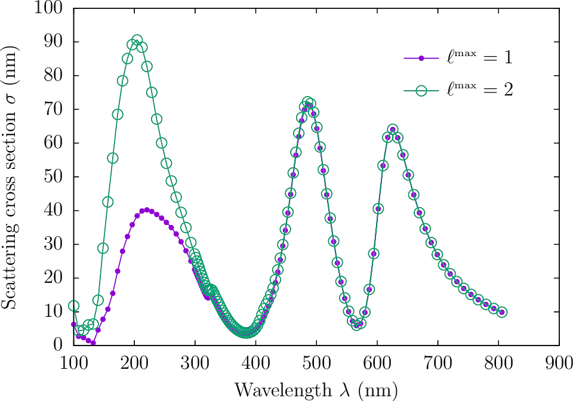
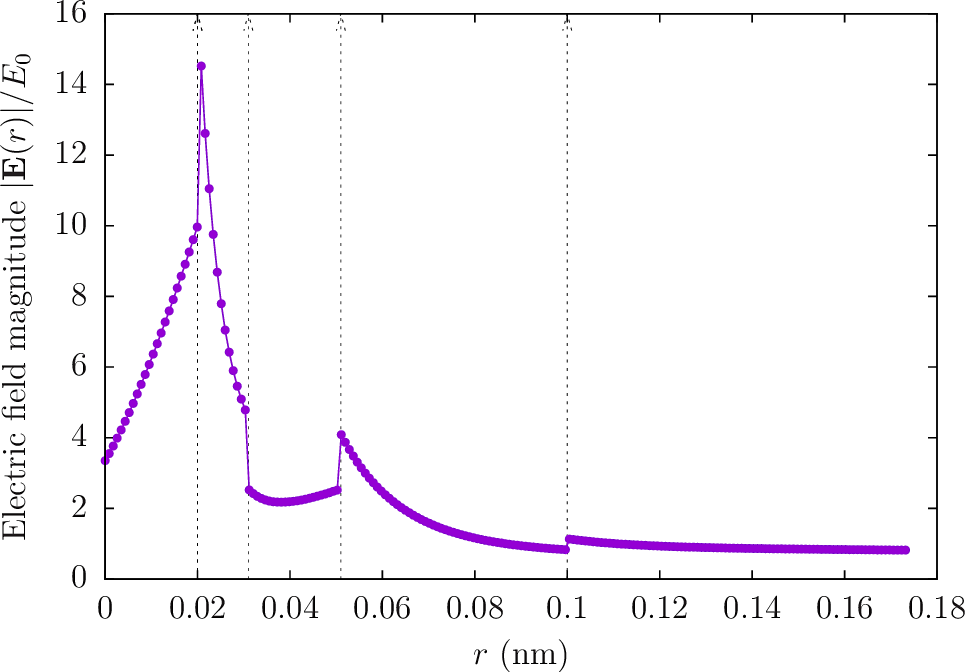

[](https://travis-ci.org/HomerReid/GLMTSolver)

# GLMTSolver
========

This is a simple code that implements a generalized Lorenz-Mie theory (GLMT)
solver for electromagnetic scattering from spherically-symmetric bodies.

The geometries that may be handled consist of arbitrarily many
spherical layers, of arbitrary inner and outer radii, each with
arbitrary frequency-dependent permittivity.

The allowed incident fields are

 + plane waves

 + spherical waves

The outputs that may be computed include 

 + scattered and total **E** and **H** fields at arbitrary points in space

 + scattered and absorbed power, force and torque as obtained by integrating the Poynting vector and Maxwell stress tensor over a bounding sphere surrounding the particle

# Theory
========

The theoretical approach and notation used by this code 
is described in [this memo][scuffSpherical]

# Specifying geometries
========

Geometries are described by simple text files conventionally given
file extension `.GLMT.` Blank lines and comments (lines starting with `#`)
are skipped. Each line specifies a single spherical layer, with
the following syntax

```
 RMAX   MATERIAL
```

where 

 + `RMAX` is the outer radius of the layer in microns

 + `MATERIAL` is a [<span font-variant="small-caps">scuff-em</span> material designation][scuffMaterials].

Here's a `.GLMT` file describing a sphere of radius 1 &mu;m with dielectric constant 10:

````
1.0	CONST_EPS_10
````

And here's a `.GLMT` file describing the
 [doubly-resonant multilayered spherical particle](WadePaper)
considered by C. W. Hsu et al, "Theoretical criteria for
scattering dark states in nanostructured particles:"

````
0.100 	SiO2
0.051 	Silver
0.031 	SiO2
0.020	Silver

````

If one of the layered material regions in your geometry is
actually a void (no material), give it material property VACUUM.
For example, here's a geometry describing the layered particle
above, but with the silver removed to yield just two concentric 
spherical shells of SiO2.

````
0.100 	SiO2
0.051 	VACUUM
0.031 	SiO2
0.020	VACUUM

````

# Structure of the code
========

`GLMT-scatter.cc` builds to yield a standalone executable
command-line code that implements a subset of the functionality
of [<span font-variant="small-caps">scuff-scatter</span>][scuffScatter]
(see examples below).

The main solver is implemented in the code file `GLMTSolver.cc`
The routine `CreateGLMTSolver()` parses a `.GLMT` file and constructs
a data structure named `GLMTSolver` containing all information
the scattering geometry. This structure contains tables of 
spherical-wave coefficients which are initialized for a 
given frequency and a given incident field by the routine
`Solve()'. Once `Solve()` has been called, you can 
call post-processing routines:

 + `GetFields()` computes the scattered and total **E** and **H** fields
   at arbitrary points in space

 + `GetDSIPFT()` computes the power, force, and torque on the body,
using the **D**isplaced **S**urface **I**ntegral computational strategy
described [in this paper][PFTPaper].

# Examples
========

## Power scattered by doubly-resonant nanoparticle

This example reproduces the "scattering dark state" example
involving a nanoparticle consisting of alternating spherical
layers of SiO2 and silver, as described
in Hsu et al, "Theoretical criteria for scattering dark states 
in nanostructured particles,” Nano Letters, 14, 2783–2788, 2014
(http://dx.doi.org/10.1021/nl500340n).

````
#!/bin/bash

for LMAX in 1 2 
do
  ARGS=""
  ARGS="${ARGS} --GLMTFile DoublyResonantParticle.GLMT"
  ARGS="${ARGS} --OmegaFile Lambda100800nm.OmegaFile"
  ARGS="${ARGS} --LMax ${LMAX}"
  ARGS="${ARGS} --PWDirection 0 0 1"
  ARGS="${ARGS} --PWPolarization 1 0 0"
  ARGS="${ARGS} --PFTFile DoublyResonantParticle.L${LMAX}.GLMTPFT"
  ARGS="${ARGS} --DSIRadius 0.2"
  GLMT-scatter ${ARGS}
done
````

(The `--DSIRadius` option controls the radius of the bounding sphere
over which the Poynting vector and Maxwell stress tensor
are integrated to compute powers and forces).

This produces files
`DoublyResonantParticle.L1.GLMTPFT` and
`DoublyResonantParticle.L2.GLMTPFT.`
To plot scattered power vs. wavelength in 
[GNUPLOT](http://www.gnuplot.info), go like this:

````bash
gnuplot> 
plot 'DoublyResonantParticle.L1.GLMTPFT' u (2*pi/$1):3 t 'LMax=1' w lp pt 7 ps 1, 'DoublyResonantParticle.L2.GLMTPFT'  u (2*pi/$1):3 t 'LMax=2' w lp pt 6 ps 2 
````



## E-field vs. radial distance for doubly-resonant nanoparticle

Here's how to obtain a plot of the spatial variation of the
**E**-field magnitude. First, put the *x,y,z* coordinates
of your desired evaluation points into a text file called `EvalPoints`:

````bash
0.00000000 0.00000000 0.00000000
0.00050000 0.00050000 0.00050000
...
0.09950000 0.09950000 0.09950000
0.10000000 0.10000000 0.10000000
````

Then pass this file as the `--EPFile` option to `GLMT-scatter`:

````bash
ARGS=""
ARGS="${ARGS} --GLMTFile DoublyResonantParticle.GLMT"
ARGS="${ARGS} --Omega 15"
ARGS="${ARGS} --EPFile EvalPoints"
ARGS="${ARGS} --PWDirection 0 0 1"
ARGS="${ARGS} --PWPolarization 1 0 0"
GLMT-scatter ${ARGS}
````

This produces an output file called
`DoublyResonantParticle.EvalPoints.GLMTFields.`
To plot E-field vs. radius, go like this:

````bash
gnuplot> D3(x,y,z)=sqrt($1*$1+$2*$2+$3*$3)
gnuplot> D6(x1,x2,x3,x4,x5,x6)=sqrt(x1*x1+x2*x2+x3*x3+x4*x4+x5*x5+x6*x6)
gnuplot> FILE='DoublyResonantParticle.GLMT'
gnuplot> plot FILE u (D3($1,$2,$3)):(D6($7,$8,$9,$10,$11,$12))
````



[scuffMaterials]:		http://homerreid.github.io/scuff-em-documentation/reference/Materials
[scuffSpherical]:		http://homerreid.github.io/scuff-em-documentation/tex/scuffSpherical.pdf
